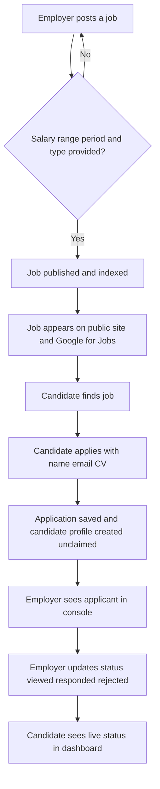
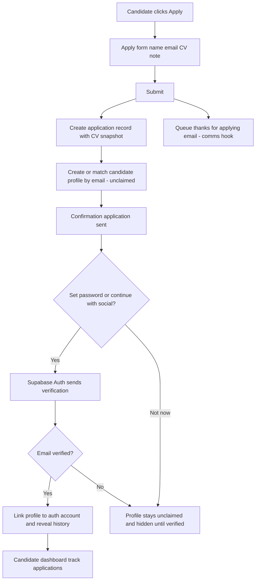
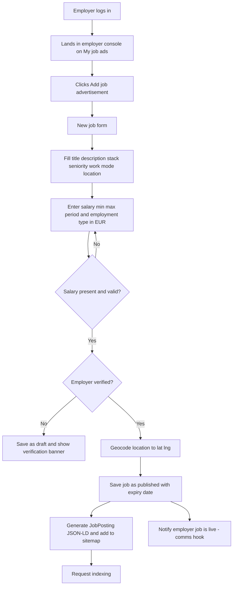
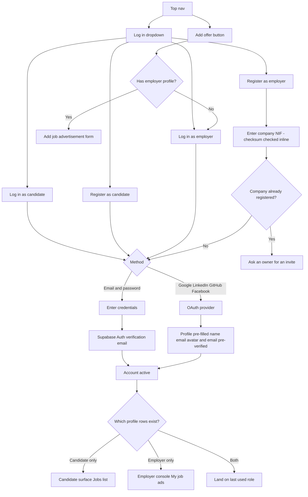
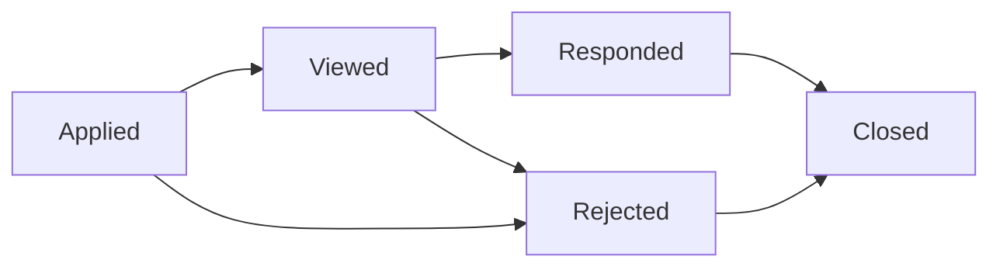
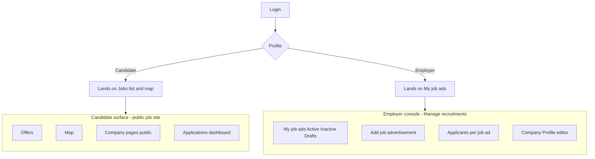
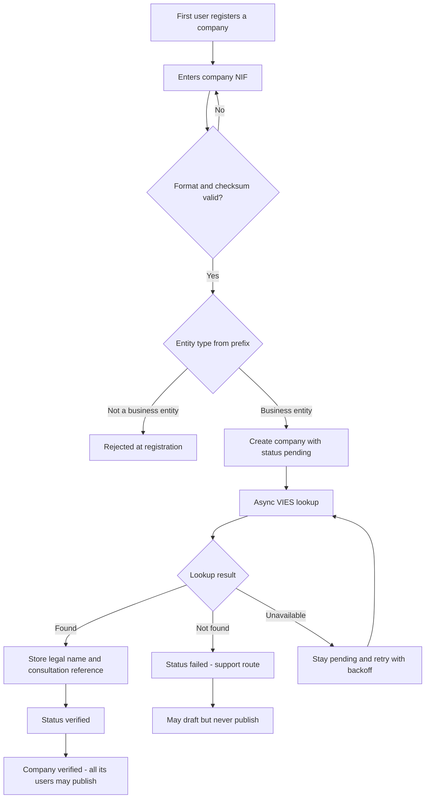

# Build Spec — SóIT MVP (Portugal)

**Version:** v1.8 · 2026-09-18

> Hand this document to Claude Code as the blueprint. Build it **phase by phase** (see Build Sequence, §14), not all at once.
>
> This is a **living document**. When you add a feature later, update the relevant section here first, then hand the delta to Claude Code as its own phase.
>
> **Flow diagrams** live in `/flows/*.mmd` as importable Mermaid files — see §10.

---

## 1. What we're building

**SóIT** — a transparency-first IT job board for the Portuguese market. *Só* is Portuguese for *only*: only IT, and only real salaries.

> **Naming convention.** The brand is **SóIT**, accent included, everywhere a person sees it — logo, page titles, copy, `<title>` tags. Everything a machine reads uses the ASCII form **`soit`**: npm package name, repository, directory, Vercel project, database role names, env var prefixes and the domain. npm package names cannot contain accented characters, and an internationalised domain punycodes to `xn--sit-zma.pt` in certificates, analytics and every link a user copies. The whole product is **one working loop**:

> A company posts a job → it appears live on the public site → a candidate finds it and applies → the company sees the applicant → the candidate can track the application's status.

If that loop runs end to end, we have a product.

**Two non-negotiable rules define the product:**

1. **Every job listing must display a salary range.** Posting a job without one is blocked.
2. **Every employer is a verified business entity.** Registration requires a Portuguese **NIF / NIPC**, and the company must be **verified before its first ad can go live** (§5.7). *The rule is enforced from day one; the automated registry lookup behind it is phased (§5.7.6).*

Together they are the positioning: *every listing here is a real, verified company stating what it pays.* Neither is a setting — both are enforced in the schema and in the publish path, not by moderation after the fact.

Primary salary currency is **EUR** (target employers are nearshore/GBS centres and multinationals paying in euros). Because the salary figure *is* the product, it is specified precisely — amount, period, and employment type — in §5.2. A number without a period is not transparency.

---

## 2. Two surfaces, one database (architecture)

This is not one app with role-based views. It is **two separate application surfaces sharing one database** — the way justjoin.it (candidates) and rocketjobs.com (employers) are built:

- **Candidate surface** — the public job site. Browsing, job pages, company pages, map, and the candidate's own account area. Candidates land here. This is the SEO-critical, publicly-indexed surface.
- **Employer console** — a dedicated authenticated admin ("Manage recruitments"). Posting and managing job ads, viewing applicants, editing the company profile. Employers land here after login. Employers **never** land in the candidate job feed — they have no reason to browse.

### 2.1 How "two surfaces" is actually deployed (decided in v1.2)

"Separate surfaces" is a **product and routing** statement, not a deployment one. Build it as:

- **One Next.js application**, one repository, one Vercel project.
- **Two App Router route groups:** `(candidate)` and `(console)`, each with its **own shell layout** — separate navigation, separate styling weight. They share nothing but the design tokens, the Supabase client, and the database.
  - *Precision (v1.8, found while building step 1):* Next.js permits multiple **root** layouts only when the route groups sit at the top of `app/`. Because every URL is locale-prefixed (§2.2), the root layout is `app/[locale]/layout.tsx` — it owns `<html>`, `<body>` and font loading — and the two shells are **nested** layouts beneath it. The surfaces stay as separate as intended; only the html/body wrapper is shared, which is what you want anyway.
- **Both sit under a locale segment: `/[locale]/…`** (§2.2). The console lives at `/[locale]/recruit`. Moving it to a `recruit.[domain]` subdomain later is a routing change, not a rewrite.

### 2.2 Bilingual from day one — PT + EN (decided v1.6)

The site ships **Portuguese and English together**, on a **`.pt` domain**. This is a launch decision, not a later phase, because locale routing shapes every URL and retrofitting it invalidates indexed pages.

- **Both locales are explicitly prefixed:** `/pt/jobs/[slug]` and `/en/jobs/[slug]`. Neither is unprefixed. An unambiguous prefix per locale keeps `hreflang` clean and avoids the classic bare-root duplicate-content problem.
- **`/` redirects** on `Accept-Language`, defaulting to `pt` — it is a `.pt` domain and Portuguese is the home market.
- **Library:** `next-intl` (App Router native, server-component friendly). Messages live in `messages/pt.json` and `messages/en.json`.
- **The UI chrome is translated; job ad content is not.** Employers write ads in whatever language they choose — we do not translate them. `jobs.language` (§5.2) records which, so the feed can badge and filter it. A Portuguese ad stays Portuguese on the English site, correctly labelled.
- **Every translatable string goes through `next-intl` from the first component.** Hard-coded English in step 1 that gets swept up later is the single most common way bilingual builds rot.

Do **not** split this into two apps or a monorepo. §7.3's shared top-nav (the role-split **Log in** dropdown and the **Add offer** button live on the public surface) and the shared session make a split actively expensive, and it buys nothing the route groups don't already give us.

Both surfaces read/write the same Postgres database (jobs, employers, candidates, applications). Separation of concerns is enforced at the route-group and **RLS** level (§6), not by separate deployments.

---

## 3. Tech stack (pinned)

Chosen above all so the **candidate surface** is server-rendered and individually crawlable by Google — discovery leans on organic search and Google for Jobs, and a client-side-only SPA fails to get indexed, killing that channel silently. Do not build the public surface as a client-rendered SPA. (The employer console is behind login and not SEO-sensitive, so it can be more app-like.)

- **Framework:** Next.js (App Router) — SSR/SSG, per-job crawlable URLs.
- **Database:** PostgreSQL via **Supabase** (Postgres + auth + file storage in one service).
- **Auth:** Supabase Auth — email/password **plus** social login (Google, LinkedIn, GitHub, Facebook). See §9.
- **File storage:** Supabase Storage (CVs, company logos/covers). CV bucket is **private**; see §6.3.
- **Map:** MapLibre GL. See §8 for the tile and geocoding providers — these are named, because "OpenStreetMap" alone is not a provider.
- **i18n:** `next-intl` — PT + EN, both locale-prefixed (§2.2).
- **Styling:** Tailwind CSS. Design direction and tokens in §11. **Tokens land in build step 1**, not at the end.
- **Hosting:** Vercel.

---

## 4. SEO / Google for Jobs architecture (candidate surface — do not skip)

Getting into **Google for Jobs** is free (no paid placement) but has hard requirements:

1. **Every published job has its own server-rendered URL:** `/jobs/[slug]`. Content in the server-rendered HTML.
2. **`JobPosting` JSON-LD on every job page**, matching the visible content exactly. Fields: `title`, `description`, `datePosted`, `validThrough`, `hiringOrganization` (name + logo), `jobLocation` and/or `applicantLocationRequirements` + `jobLocationType: "TELECOMMUTE"`, `employmentType`, and `baseSalary` (min, max, currency, **`unitText`**). The salary field doubles as an SEO signal.
   - `baseSalary.unitText` maps directly from `jobs.salary_period` (§5.2): `month` → `MONTH`, `year` → `YEAR`, `day` → `DAY`, `hour` → `HOUR`.
   - `employmentType` maps from `jobs.employment_type`: `permanent`/`fixed_term` → `FULL_TIME`, `contractor`/`freelance` → `CONTRACTOR`, `internship` → `INTERN`.
3. **Company pages** (`/companies/[slug]`) are also public, server-rendered, indexable pages — extra organic surface area. Optionally carry `Organization` JSON-LD.
4. **Dynamic `sitemap.xml`** (all live jobs + company pages, **both locales**) and **`robots.txt`**.
   - **`hreflang` on every public page**, pairing `/pt/…` ↔ `/en/…` and declaring `x-default` → the `/` language redirect. Each locale's page carries a self-referencing canonical.
   - `JobPosting` JSON-LD is emitted on **both** locale URLs, each matching its own visible content (§2.2).
5. **Expired/closed jobs** stop returning structured data and drop out of the sitemap. "Live" is a computed condition, not a stored flag — see §5.4.
6. **Google Search Console**; optionally the **Indexing API** for ~1–24h pickup.

> **Expectation-setting (added v1.2):** correct JSON-LD gets you *eligible*, not *ranked*. A brand-new domain typically takes weeks to months to earn Google for Jobs traffic, and a board with no listings converts nobody regardless. Organic is the long game; it is not the launch plan. See §15.2.

---

## 5. Data model

Several fields support **later** features (matching, response rates) without a future rewrite. Access control for every table is specified in §6.

### 5.1 `companies` and `employer_users` (split in v1.5)

v1.1–v1.4 had a single `employers` table carrying both the business and its one login. That conflated two different things and capped every employer at **one user account** — with `nif` unique as well (§5.7), a second recruiter at the same company could not register at all. The employer side is therefore two tables: **a company is an organisation; an employer user is a person who works for it.**

#### `companies` — the business entity
- `id` (uuid, pk) · `company_name` · `slug` (unique — public company page URL; see §5.5)
- **Identity / verification (§5.7)** — belongs to the **company**, not to any user:
  - `nif` (char(9), **required**, **unique**) · `nif_country` (default `PT`)
  - `verification_status` (`unverified` | `pending` | `verified` | `failed`; default `unverified`)
  - `verified_legal_name?` (registered name as returned by the source — cross-checked against `company_name`)
  - `verified_at?` · `verification_source?` (`vies` | `provider` | `manual`) · `verification_reference?`
- `company_logo_url?` · `cover_image_url?` · `company_description?` · `website?`
- `industry?` · `company_size?`
- `created_at`

#### `employer_users` — a person's membership of a company
- `id` (uuid, pk) · `auth_user_id` (fk → `auth.users`, **unique**) · `company_id` (fk → `companies`)
- `role` (`owner` | `member`) · `created_at`
- `invited_by?` (fk → `employer_users`) · `invite_accepted_at?`
- **`unique (auth_user_id)`** — one person belongs to one company in the MVP. Agency recruiters working across several companies are a later feature; lifting this constraint is additive.

**Roles, kept deliberately thin.** `owner` can edit the company profile and manage the team; `member` cannot. **Both** post jobs and see all of the company's jobs and applicants. Per-job permissions are deliberately not modelled — they are a real feature request later, and inventing them now buys nothing.

#### `employer_invites`
- `id` (uuid, pk) · `company_id` (fk) · `email` (lowercased) · `role` · `token` (unique) · `invited_by` (fk) · `expires_at` · `accepted_at?` · `created_at`

**Registering against a NIF that already exists** must not create a duplicate company. The registration form detects it and says so: *"This company is already registered. Ask one of its admins to invite you."* It never leaks who those admins are. This is the single most likely real-world signup collision once a company has more than one recruiter.

> **Scope note.** The **schema split is the part that must happen now** (build step 2) — it is what the later migration would be expensive. The **invite UI** is ordinary console work (step 4) and can slip a phase without any migration cost: until it lands, a company simply has its founding `owner`.

### 5.2 `jobs`
- `id` (uuid, pk) · `company_id` (fk → `companies`) · `created_by` (fk → `employer_users`) · `slug` (unique; see §5.5)
- `title` · `description` (HTML) · `language` (`pt` | `en` — the language the ad is written in, §2.2) · `seniority` (junior | mid | senior | lead) · `work_model` (remote | hybrid | office)
- `location?` · `latitude?` · `longitude?` (map; geocoded at post time)
- **Salary — the product's defining data (revised v1.2):**
  - `salary_min` (int, **required**) · `salary_max` (int, **required**)
  - `salary_currency` (default `EUR`)
  - `salary_period` (**required**; `hour` | `day` | `month` | `year`; **default `month`**)
  - `employment_type` (**required**; `permanent` | `fixed_term` | `contractor` | `freelance` | `internship`)
- `status` (draft | published | inactive | closed) · `published_at?` · `expires_at` (→ `validThrough`) · `created_at` · `updated_at`
- Tech stack is a relation, not a column — see §5.6.

> **Published jobs are editable (decided v1.5).** An employer may edit a live ad, salary included. Three consequences to build, not to debate:
> 1. **Every salary change writes a `job.salary_changed` event** (§12.2) carrying job id, actor, old and new values. This product's entire premise is that the posted number is real; posting 50–60k and quietly editing to 30–40k after indexing is precisely the bait-and-switch the board exists to prevent. Nothing consumes the event in the MVP — but the history has to exist *before* you need it, and it is one insert.
> 2. **Editing a live ad refreshes its SEO surface** — regenerate the `JobPosting` JSON-LD, bump `updated_at`, and re-request indexing (§4.6). Stale structured data that contradicts the visible page is a Google for Jobs violation.
> 3. **Editing never silently republishes.** Editing an expired or inactive ad leaves it expired or inactive; going live again is an explicit action that re-checks the publish gate (§5.7.4).
>
> **Why period and employment type are required (v1.2).** Portugal quotes salaries as **monthly gross**, over **14 months** (subsídio de férias + Natal). "2000–3000" is genuinely ambiguous between monthly and annual, and the 12-vs-14-month reading differs by ~17%. Separately, Portuguese IT hiring is split between *contrato de trabalho* and *recibos verdes* contracting — a contractor day rate and a permanent monthly salary rendered in the same bold figure actively mislead, which corrodes the one thing this product sells. `unitText` is also a hard Google for Jobs requirement (§4.2).
>
> **All amounts are gross.** State this in the UI next to every figure — not in a footer. Where `salary_period = month`, the job form asks the employer whether the range is paid over 12 or 14 months and stores it in `salary_months` (int, default 14); the job page renders it ("× 14 months").

### 5.3 `candidates`
- `id` (uuid, pk) · `auth_user_id?` (fk → `auth.users`, unique, **nullable**: profile created on apply, before password/social is set)
- `full_name` · `email` (**unique, lowercased** — this is the match key in Flow B) · `phone?` · `cv_url?` · `linkedin_url?` · `avatar_url?` (pre-fillable from social login)
- `auth_provider?` (email | google | linkedin | github | facebook)
- `email_verified` (bool, default false — **gates profile claiming**, see §6.4)
- `skills` (text[] — foundation for future matching; not captured in the MVP apply form. When populated, values must be `tech_tags.slug` values, §5.6)
- `created_at`

### 5.4 `applications`
- `id` (uuid, pk) · `job_id` (fk) · `candidate_id` (fk) · `cv_url` (snapshot — the CV as submitted, never overwritten by later profile edits) · `cover_note?`
- `status` (applied | viewed | responded | rejected | **closed**) · `created_at` · `status_updated_at`
- **`unique (job_id, candidate_id)`** — one application per candidate per job. Without it nothing prevents fifty duplicate submissions.

> `applications.status` powers the candidate's tracking dashboard **and** is the raw data for the future employer-response-rate feature. One field, two payoffs.
>
> **v1.2 fix:** `closed` was missing from the enum while Flow E terminated both branches there. It is now a real terminal state.

### 5.5 Slugs and job lifecycle (added v1.2)

**Slugs.** Both slug columns are unique, and collisions are real (two companies with similar names; two "Senior Java Developer" ads at one employer):
- `jobs.slug` = `slugify(title)` + `-` + a short base36 suffix derived from the row id. Always suffixed, so it never collides and never needs a retry loop.
- `companies.slug` = `slugify(company_name)`, checked at write time; on collision append `-2`, `-3`, … Company slugs are user-facing branding, so they stay clean.

**Expiry has a mechanism now.** There is **no scheduled job and no `expired` stored status**. A job is **live** if and only if:

```
status = 'published' AND expires_at > now()
```

That condition is the single definition used by the job list, the job page, the sitemap, and the JSON-LD (§4.5). "Expired" is a **derived display state**, shown as a badge in the console. `expires_at` defaults to `published_at + 30 days`; the employer can extend it when editing. Re-publishing an expired ad is just moving `expires_at` forward.

This also resolves the v1.1 mismatch where `jobs.status` had five values and the console showed three tabs: see §7.2.

### 5.6 Tech stack is a controlled vocabulary (changed v1.2)

v1.1 had `jobs.tech_stack text[]` and filtered on it. Free-text arrays mean **"React", "ReactJS" and "react.js" become three different filter values**, and the filter degrades permanently as the board grows. Normalising an array into a relation later is a **migration, not an addition** — which is exactly what §12.1 promises never to do. So it is a relation from day one:

- **`tech_tags`** — `id` (uuid, pk) · `slug` (unique, e.g. `react`) · `label` (e.g. `React`) · `aliases` (text[], e.g. `{reactjs, react.js}`) · `created_at`
- **`job_tech_tags`** — `job_id` (fk) · `tech_tag_id` (fk) · pk on both

Seed `tech_tags` with ~150 common IT tags at build step 2. The job form offers autocomplete over the vocabulary; employers pick, they do not free-type. New tags are added by us, not by employers — that is what keeps the filter usable.

### 5.7 Employer identity verification — NIF (new in v1.3)

Employer accounts require a valid Portuguese **NIF** (Número de Identificação Fiscal; for companies, historically **NIPC**). It is not enough that the number is well-formed — it must resolve to a **real business entity**. This is the second of the product's two hard rules (§1).

#### 5.7.1 Three layers, because no single source is sufficient

| Layer | What it does | Cost | Catches | MVP |
|---|---|---|---|---|
| **1. Format + checksum + prefix** | Offline, instant, always runs | Free | Typos, invented numbers, wrong entity type | **Ships** |
| **2. VIES** (EU VAT Information Exchange System) | Confirms the entity and, for Portugal, returns its **registered legal name** | Free, no key | Entities registered for intra-EU operations | *Deferred — stubbed, §5.7.6* |
| **3. Commercial registry provider** (NIF.pt, Racius, Informa D&B) | Authoritative company lookup: name, status, CAE | Paid / freemium | Everything VIES misses — see the caveat below | *Deferred — stubbed, §5.7.6* |

The design below is the **target**; §5.7.6 defines what phase 1 actually builds and how the remote layers plug in without touching anything else.

> **The caveat that decides the architecture:** VIES only knows entities enrolled for **intra-community** operations. A perfectly real Portuguese company trading only domestically returns **invalid** from VIES. A negative VIES result therefore means *unconfirmed*, **never** *rejected* — otherwise we reject legitimate customers. VIES is also genuinely flaky (it proxies each member state's national system and returns `MS_UNAVAILABLE` regularly), so it can never be a hard dependency in a signup path.
>
> There is **no free public API from Autoridade Tributária**. The Portal das Finanças NIF lookup is a captcha-protected human form, and AT's real web services are e-invoicing endpoints requiring qualified certificates. Do not design around an AT integration — it does not exist for this purpose.

#### 5.7.2 Layer 1 — checksum (mod 11) and prefix rules

```
digits d1..d9
sum   = d1*9 + d2*8 + d3*7 + d4*6 + d5*5 + d6*4 + d7*3 + d8*2
r     = sum mod 11
check = 0 if r < 2 else 11 - r
valid = (d9 == check)
```

The checksum alone is **not** a business check — `000000000` passes it. The leading digits carry the entity type, and that is what actually gates registration:

| Prefix | Entity type | Decision |
|---|---|---|
| `5` | Collective person (company) | **Auto-accept** — the overwhelming majority of real customers |
| `6` | Public entity / administration | **Auto-accept** — public-sector IT hiring is real volume in PT |
| `71`, `72` | Non-resident collective entity, investment fund | **Accept** — a multinational hiring into PT without a local entity is a target customer (§1) |
| `1`, `2`, `3`, `45` | Natural person | **Reject** — not a business entity |
| anything else | Condominiums, irregular entities, invalid prefixes | **Reject** |

**This excludes sole traders** (*empresário em nome individual* / recibos verdes), who legally trade under a personal NIF starting 1–3. That is the direct consequence of "valid business entity" meaning what it says, and it is the rule that needs no human to apply. If one-person consultancies later turn out to be real demand, the fix is to widen this table — a pure-function change with no schema impact.

#### 5.7.3 Verification is a state machine, not a boolean

**Verification is fully automatic. There is no human step and no admin queue** (decided v1.6). `verification_status` moves `unverified` → `pending` → (`verified` | `failed`), decided entirely by the registry integration. Rules:

- **Layer 1 runs inline and synchronously** at registration — pure arithmetic, so a bad NIF is rejected in the form, immediately, with no account created.
- **Layers 2–3 run asynchronously** in a server-side route handler, never inline in the signup request. A third-party call in the critical path of registration is how you lose signups when the third party is down.
- Lookup `found` → `verified`. Lookup `not_found` → `failed`, shown plainly in the console with a support contact.
- **Provider unavailable → stays `pending`, retried with exponential backoff.** It never becomes `failed` because a network call timed out, and it never auto-passes either.
- The returned legal name is stored in `verified_legal_name` and **not** used as a hard gate — legal and trading names legitimately differ ("Critical TechWorks" vs "CRITICAL TECHWORKS, S.A."). It is display and audit data.
- Store `verification_reference`. VIES's `checkVatApprox` call, made with our own VAT number, returns a **consultation number** — durable evidence that we checked.

> **The one edge to know about:** VIES only covers entities registered for intra-EU operations (§5.7.1), so a real domestic-only Portuguese company can return `not_found`. With no manual review, those employers land in `failed` and need the support route to get unstuck. If that turns out to be more than a trickle, the answer is layer 3 (a commercial registry provider), not a human queue.

#### 5.7.4 The gate is at **publish**, not at signup

An unverified employer **can** register, complete the company profile, and draft job ads. They **cannot publish**. The publish action re-checks `verification_status = 'verified'` server-side, and a draft saved by an unverified employer stays a draft.

This is deliberate:
- A provider outage degrades the funnel instead of blocking it entirely — a `pending` employer keeps working and publishes the moment verification clears.
- The asset that needs protecting is the **public listing**, not the account row.
- It keeps friction off the first touch, which matters given the cold-start problem (§15.2).

#### 5.7.5 Consequences to be aware of

- **Verification belongs to the company, not the user** (§5.1). `nif` is unique on `companies`; every `employer_users` row of that company inherits its verification state. A newly invited recruiter at an already-verified company can publish immediately — they do not re-verify. *(v1.4 and earlier put `nif` on a table that was also the login, which capped every company at one user; resolved by the v1.5 split.)*
- **Verification also protects the SEO channel.** Google for Jobs delists sites that carry spam or fake postings; a verified-employer rule is a direct defence of the §4 acquisition channel, not only a candidate-trust feature.
- **Verified company name is a UX win, not just a check.** Layer 2 returns the registered name, so the signup form can **auto-fill company name from the NIF**. Verification becomes a feature that makes registration *faster* — which is the mitigation for adding a second adoption tax (§15.2).

#### 5.7.6 The integration ships (decided v1.6)

The registry lookup is **built as part of the MVP**, not deferred and not stubbed. Earlier drafts proposed a manual-review fallback; that is removed — **there is no admin verification step in this product.**

- **`NifRegistryProvider`** stays as the interface — `lookup(nif) -> { outcome: 'found' | 'not_found' | 'undetermined', legalName?, reference?, source }` — so the provider behind it can change without touching callers.
- **Phase 1 implements `ViesProvider`** against it. VIES is free, needs no key, no contract and no budget approval, which is why it is buildable now.
- A commercial registry provider (layer 3) is a second implementation of the same interface, added only if VIES misses prove more than a trickle (§5.7.3).
- Build **layer 1 first and test it exhaustively** — it is a pure function, it gates registration inline, and it is the one piece that must never be wrong.

---

## 6. Security, access control & data protection (new in v1.2)

v1.1 described two surfaces over one database and never mentioned Row Level Security. On Supabase, **RLS is the security model** — without it, any authenticated employer can read every other employer's applicants and every CV in the system. This section is a **build step 2 deliverable**, alongside the schema, not step 9 polish.

### 6.1 Principles
- **RLS enabled on every table.** No exceptions, including `tech_tags`.
- **Deny by default.** Every table starts with no policy and gains only the policies below.
- Privileged writes that cross a tenant boundary (creating an application, linking a claimed profile) run **server-side in Next.js route handlers using the service role key**, never from the browser. The service role key is server-only and never reaches the client bundle.

### 6.2 Policy table

| Table | Public (anon) | Candidate (authenticated) | Employer (authenticated) |
|---|---|---|---|
| `jobs` | `select` where **live** (§5.5) | same as public | full CRUD **where `company_id` = `my_company_id()`** |
| `companies` | `select` (public company page fields **only** — never `nif` or verification columns) | `select` (same restriction) | `select` own; `update` own **only if `role = 'owner'`**; `nif` writable once at registration, `verification_*` columns are **server-write only** |
| `employer_users` | none | none | `select` rows of **own company**; `insert`/`delete` only if `role = 'owner'` |
| `employer_invites` | none | none | full CRUD for **own company**, `owner` only |
| `candidates` | none | `select`/`update` **own row** (`auth_user_id = auth.uid()`) | none — employers reach applicant data only via `applications` |
| `applications` | none | `select` **own** (`candidate_id` = own candidate row); no update | `select` + `update status` where the application's `job_id` belongs to one of their jobs |
| `tech_tags` / `job_tech_tags` | `select` | `select` | `select`; join rows writable for own jobs |
| `events` (§12.2) | none | none | none — server-side inserts only |

**Write the company lookup once, as a SQL function, and use it in every employer-scoped policy:**

```sql
create function my_company_id() returns uuid
language sql stable security definer as $$
  select company_id from employer_users where auth_user_id = auth.uid()
$$;
```

The employer policy on `applications` is the one that matters most: it must be written as a join back through `jobs.company_id` to `my_company_id()`, never as a trusted client-supplied parameter. Centralising it in one function is also what makes the v1.5 split cheap — the membership rule lives in a single place, so allowing multi-company membership later changes one function, not every policy.

### 6.3 CV storage
CVs are personal data. Therefore:
- The **`cvs` bucket is private.** Not public-with-an-unguessable-URL — private. A public bucket makes every CV world-readable to anyone who obtains or guesses a link.
- `candidates.cv_url` and `applications.cv_url` store the **storage object path**, not a public URL.
- The employer console renders CVs through **short-lived signed URLs** (≤ 15 minutes) minted server-side, only after the RLS check in §6.2 passes.
- Company logos and cover images are genuinely public and live in a separate public `branding` bucket.

### 6.4 Role: where it actually lives (resolves the v1.1 gap)

Flow D routes on `{Role}` and v1.1 never said where role was stored. Decided:

- **A person is not a role.** One `auth.users` row may own **at most one `employer_users` row and at most one `candidates` row**. Dual-role is allowed and expected — recruiters job-hunt too, and blocking that creates duplicate-account support tickets forever.
- **Employer access is membership, not ownership.** A person is an employer because they hold an `employer_users` row; what they can reach is their **company's** data, via `my_company_id()` (§6.2). `owner` vs `member` governs only company-profile edits and team management (§5.1).
- The **role chosen at the entry point** (§9) determines which profile row gets created on registration, and is written to `auth.users.raw_user_meta_data.last_role`.
- **Landing after login** (§9, Flow D): if the user holds only one profile row, land on that surface. If they hold both, land on `last_role`. Every login through a role-specific entry point updates `last_role`.
- **Authorisation never reads `last_role`.** It is a *landing preference only*. Access is always decided by the existence of the relevant profile row, enforced in RLS (§6.2). Metadata is user-writable in some Supabase configurations; treating it as an authorisation source would be a hole.

### 6.5 Profile claiming must be verified (resolves a v1.1 exploit)

v1.1: apply without an account creates a `candidates` row keyed by email, "claimable later via same email". As written, **anyone can apply using someone else's email address**, and the real owner later inherits applications they never made — or an attacker registering an unverified address inherits a stranger's application history and CV.

Rule: **an unclaimed `candidates` row (`auth_user_id IS NULL`) is linked to an auth user only after that address is verified.**

1. Apply creates or matches the `candidates` row on lowercased email, with `email_verified = false`.
2. The row is **invisible to everyone** until claimed — no candidate dashboard, no login.
3. Claiming (set a password, or continue with a social account whose **verified** email matches) triggers Supabase Auth verification.
4. Only on verification does the server set `auth_user_id` and `email_verified = true`, and the full application history becomes visible.
5. Applications submitted against an address that is never verified stay in the database and remain visible to the employer — the employer still received a real application — but never attach to an account.

### 6.6 GDPR (EU market — a launch precondition, not polish)

The product stores names, emails, phone numbers and **CVs of people who never created an account**, in the EU. This is not deferrable:

- **Lawful basis.** Applying is the performance of a request by the data subject; the account-free path still needs a clear notice at the point of the apply form, not buried in a footer.
- **Controller relationship.** Once an employer views an applicant, they are a **separate controller**. The employer terms must say so, and the console must surface it.
- **Retention.** Default: applications and their CV snapshots are deleted **12 months** after `status_updated_at`; unclaimed `candidates` rows with no live applications are deleted after 12 months. Implement as a scheduled purge — this is the one place a cron is genuinely required.
- **Erasure and access.** A candidate must be able to request deletion and export. MVP-acceptable implementation: a documented email route with a defined SLA, actioned from the Supabase dashboard (there is no admin UI, §5.7.3). A self-serve button is better and belongs in the first post-MVP phase.
- **Privacy policy + cookie/consent** on the candidate surface before launch. Keep analytics cookie-free if possible so the consent banner stays trivial.
- **NIF is personal data when it belongs to a sole trader** (§5.7.2, prefixes 1–3) — it is that individual's personal tax number. Company NIFs (prefix 5) are public business-register data and far less sensitive. Treat the column as personal data regardless: never expose it on the public company page by default (§15.1), restrict it to the owning employer and admins in RLS (§6.2), and include it in the retention and erasure paths above.

> This section describes obligations, not legal advice. Have the policy and employer terms reviewed before launch.

### 6.7 The anonymous apply endpoint (added v1.4)

Account-free apply (§7.1, Flow B) is the growth loop **and** the most exposed surface in the product: an unauthenticated `POST` that accepts a **file upload** from anyone on the internet. It needs constraints specified, not discovered:

- **File type allowlist by content sniffing, not extension** — PDF and DOCX only. Reject on the server; never trust the client-declared MIME type.
- **Size cap** (5 MB is generous for a CV) enforced at the edge, before the body is buffered.
- **Rate limit per IP and per email**, and a cap on applications per candidate per day. Without it, one script can fill an employer's applicant list and poison the `applications` table the response-rate feature will later read.
- **Never serve uploads from the application's own origin.** Supabase Storage is a separate domain, which already contains stored-XSS risk from a malicious PDF — keep it that way, and serve only via the short-lived signed URLs of §6.3.
- **Bot protection** on the apply form. A privacy-respecting challenge (Cloudflare Turnstile) over reCAPTCHA, to keep §6.6's consent story simple.
- Validate that the target job is **live** (§5.5) server-side. An expired or draft job must not accept applications even if the form is replayed.

---

## 7. Navigation & screens

### 7.1 Candidate surface (public job site)

Public browsing, plus a personal account area reachable from a persistent **left icon rail** (as on justjoin.it). Browsing items stay on the public surface; personal items open the candidate dashboard.

**Landing:** logged-in *and* logged-out candidates land on the **Jobs list / map**. The rail's personal items appear only when logged in.

**Rail items (MVP vs later)**
- Offers (jobs list) — **MVP**
- Map — **MVP**
- Applications (tracking dashboard) — **MVP**
- Companies (browse company pages) — **MVP** (the public company pages are in scope; a dedicated browse index can be light)
- Favorites · Recently viewed · Profile · CV · Recommendations · Communication · Saved alerts · Settings — *later*

**Public pages (server-rendered, SEO-critical)**
- Job list (`/[locale]/jobs`) — filters: tech stack (from `tech_tags`, §5.6), seniority, work model, location, salary, employment type, **ad language**; salary on every card **with its period**
- Map view — split list + map (§8)
- Job detail (`/jobs/[slug]`) — salary prominent and unambiguous (amount + period + × months + gross + employment type), `JobPosting` JSON-LD, Apply button, links to the company page
- **Company profile page (`/companies/[slug]`)** — public, indexable: logo/cover, description, website, and the company's live jobs. A key SEO + employer-branding asset.
- Apply — no account required; triggers the account loop (Flow B), subject to §6.5

**Candidate account (logged in)**
- Applications dashboard — history with status (applied → viewed → responded)
- Claim-account prompt after applying

### 7.2 Employer console ("Manage recruitments")

A separate authenticated surface (route group `(console)`, path `/recruit`, §2.1) with its own sidebar. **Landing:** logged-in employers land on **My job ads**.

**Console sidebar (MVP vs later)**
- My job ads — **MVP**
- Team — **MVP** — list of the company's `employer_users`, invite by email, remove. **`owner` only**; `member` does not see it. The invite UI may slip a phase without cost (§5.1) — the schema may not.
- Company Profile — **MVP** — editor for the public company page (§7.1): name, logo, cover, description, website, industry, size. **`owner` only.** Shows the **NIF and verification state** (§5.7) — read-only once verified, with a clear banner while `pending` ("checking, you can keep drafting") or `failed` ("we could not confirm this NIF" + support contact).
- Matchmaking · My products · Pricing (billing) · Contact — *later*

**My job ads — three tabs (clarified v1.2)**

`jobs.status` has four stored values and expiry is derived (§5.5), so the tabs are defined as:

| Tab | Contains | Row badge |
|---|---|---|
| **Active** | `published` **and** `expires_at > now()` | applicant count |
| **Inactive** | `published` but expired · `inactive` (paused) · `closed` | `Expired` / `Paused` / `Closed` |
| **Drafts** | `draft` | — |

No job is ever invisible to the employer who owns it — the v1.1 tab set silently hid expired and closed ads from their own author.

**Console actions**
- **Add job advertisement** (button) → job form. **Salary min, max, period and employment type required; submission blocked without them** (§5.2). Geocodes on save.
- **Publish is gated on employer verification** (§5.7.4). An unverified employer can write and save drafts; the publish action re-checks `verification_status = 'verified'` server-side and otherwise keeps the ad as a draft with an explanatory banner. Drafting is never blocked — only going live is.
- Open a job ad → **Applicants** view — applicant list + CV access via signed URL (§6.3) + status updates (viewed / responded / rejected / closed) that flow to the candidate's dashboard.
- **Edit a published job ad** — allowed, including salary (§5.2). The form is the same one used to create it; saving re-runs validation, writes `job.salary_changed` where relevant, and refreshes the JSON-LD.
- Every job ad and applicant list is scoped to the **company**, not to the user who created it (§6.2) — any member of the company sees the company's whole pipeline. `jobs.created_by` records authorship for display only.

### 7.3 Shared / auth
- Top-nav (public surface): **Log in** (role-split dropdown, §9) + **Add offer** (employer shortcut) + search + **language switcher** (PT / EN, preserving the current path, §2.2).
- Login / register (email/password + social), verification.

---

## 8. Map view

In the MVP, kept cheap and sequenced not to block the revenue loop:

- **Capture coordinates from day one** (`latitude`/`longitude` in `jobs`, geocoded at post time) so the map is never a retrofit.
- **Build the view after the core loop closes** (§14 step 8) — it's just a view over data you already hold.
- Fully-remote jobs have no coordinate — group them in a "Remote" list beside the map, no fake pin.

### 8.1 Providers — named, and honestly costed (corrected v1.2)

v1.1 claimed "**Cost €0:** Leaflet/MapLibre + OpenStreetMap". OpenStreetMap is a dataset, not a hosted service, and its community-run endpoints carry usage policies that a commercial job board does not satisfy. Corrected:

| Need | Provider | Reality |
|---|---|---|
| **Tiles** | **MapTiler** free tier (~100k loads/mo) | The public `tile.openstreetmap.org` server forbids heavy/commercial use and will block us. Protomaps (self-hosted `.pmtiles` on object storage) is the €0 alternative if the free tier is ever exceeded. |
| **Geocoding** | **Nominatim** public instance | Free, but **max 1 req/sec**, requires an identifying `User-Agent`, and discourages commercial bulk use. Our volume is one call **per job posted**, so this is comfortably inside the policy. Photon or a paid geocoder is the fallback if posting volume ever makes it marginal. |
| **Library** | MapLibre GL | Open source, no key of its own. |

**Geocode once at post time and store the result. Never geocode on page load.** Cost at MVP volume is effectively zero — but it is "free tier", not "free", and the distinction matters when the board grows.

---

## 9. Authentication & login options

Two roles: **employer** and **candidate** — as *profiles a person can hold*, not as mutually exclusive account types (§6.4). Both support **email + password** (with verification) and **social login: Google, LinkedIn, GitHub, Facebook** (all native to Supabase Auth).

### 9.1 Transactional email is in scope (resolves the v1.1 contradiction)

v1.1 promised "email + password (with verification)" in §8 and Flow D, while §12 declared that **nothing is sent**. As written, no email/password account could ever activate.

**Carve-out:** **Supabase Auth's built-in transactional email — verification, password reset, magic link — is auth infrastructure and is IN SCOPE for the MVP.** It is not the deferred communication layer. What stays out of scope (§13) is *product* messaging: application confirmations, employer notifications, alerts, digests. Those remain documented event hooks that send nothing.

Configure a real sending domain with SPF/DKIM before launch; Supabase's default sender is rate-limited and lands in spam.

### 9.2 Entry point: role is explicit from the first click
- The top-nav **Log in** button opens a dropdown split into two labelled groups:
  - **Candidate** — *Log in as candidate* · *Register as candidate*
  - **Employer** — *Log in as employer* · *Register as employer*
- A standalone **Add offer** button sits beside it — a direct path for employers to post. A logged-in employer goes to the job form; a logged-out user is routed through employer log in / register first.

The role chosen determines **which profile row is created** and **which surface they land on** (§6.4): candidates → public Jobs surface; employers → the employer console. If a person already holds both profiles, landing follows `last_role`.

**Employer registration additionally collects the company NIF** (§5.7). Layer-1 validation (format, checksum, prefix) runs **inline and synchronously** — it is pure arithmetic and rejects typos immediately. Layers 2 and 3 run **asynchronously after the account exists**, so a slow or unavailable third party never blocks registration. Where the lookup returns a registered name, the form **auto-fills the company name** from it.

**Why social matters beyond convenience:** LinkedIn and GitHub suit IT candidates and return profile data (name, email, avatar) that **pre-fills the candidate profile** — the same profile that later powers matching. Social emails arrive pre-verified, which satisfies §6.5 directly. Setup: each provider needs its own OAuth app enabled in Supabase; start with Google + GitHub + LinkedIn, Facebook can follow.

---

## 10. Flow diagrams

Importable Mermaid files in `/flows/`. **A `- comms hook` label marks where the future communication layer attaches** (emails / notifications). We do **not** build product message-sending in the MVP — but we document every touchpoint and emit an event at each one, so the comms layer plugs in later with no rewiring (§12). Auth verification email is *not* a comms hook; it ships (§9.1).

### Importing into Miro
Miro renders Mermaid natively (public beta): open a `.mmd` file, copy it, in Miro use the Creation bar → **Diagram → Build with code** → paste. It renders as **editable shapes**, auto-laid-out, and stays bi-directional (edit shapes → code updates; edit code → board re-renders). If Claude Code is connected to Miro's MCP server, an agent can create/read these diagrams on a board directly.

> **The `.mmd` files are the source of truth** and the copies below must match them exactly. In v1.1 they drifted (Flow A still said "dashboard" after the console rename). If you edit one, edit both.

### Files
| File | Flow |
|------|------|
| `flows/flow-a-core-loop.mmd` | Core marketplace loop |
| `flows/flow-b-apply-account.mmd` | Apply → account creation (verified claim) |
| `flows/flow-c-employer-post.mmd` | Employer posts a job (in the console) |
| `flows/flow-d-auth.mmd` | Authentication + role-split entry |
| `flows/flow-e-status-lifecycle.mmd` | Application status lifecycle |
| `flows/flow-f-navigation.mmd` | Navigation: two surfaces |
| `flows/flow-g-employer-verification.mmd` | Employer NIF verification (added v1.3) |

### Flow A — core marketplace loop


### Flow B — apply → account creation (verified claim)


### Flow C — employer posts a job (in the console)


### Flow D — authentication (role explicit at entry point)


### Flow E — application status lifecycle


### Flow F — navigation (two surfaces)


### Flow G — employer NIF verification (added v1.3)


> **No human step.** Layer 1 rejects inline at registration; everything after it is automatic (§5.7.3). A company sits in `pending` only while the provider is unreachable, and publishes the moment it clears.

---

## 11. Design direction

The candidate surface must look **obviously more proper and modern** than the incumbents and more focused than LinkedIn — and make **salary the hero** of every screen.

**Principle: spend the boldness in one place.** The salary figure is the memorable element; everything around it stays quiet.

### Tokens (starting point)
- **Color** — one bold color for money + primary actions:
  - `--paper` `#F7F8F7` (cool near-white — *not* warm cream) · `--ink` `#14201C` (dark green-black text)
  - `--pine` `#0C6B58` (deep emerald — brand + salary figure + primary CTA) · `--mint` `#3DDC97` (bright accent, sparing)
  - `--muted` `#5B6B66` · `--line` `#E3E7E4` (hairlines)
- **Contrast check (v1.2):** `--pine` (~6:1) and `--muted` (~5:1) on `--paper` both clear WCAG AA for body text. **`--mint` does not** — use it for fills, indicators and accents only, never for text or icons that carry meaning.
- **Type** — two distinct free families for a technical audience: **Space Grotesk** (headings) + **IBM Plex Sans** (body + salary). No monospace for data labels.
  - Salary figures must use **tabular figures** so ranges align down the feed: `font-variant-numeric: tabular-nums` (IBM Plex Sans supports it, but it is **off by default** — set it explicitly on the salary component).

### Layout
- **Job feed = the hero.** Fast, scannable. **Hairline-separated rows**, not a grid of identical rounded shadowed cards. Salary right-aligned, bold, in `--pine`.
- **The salary component is one shared component** used by the feed row, the job page and the map popover. It renders amount + period + months + employment type from one prop set, so a salary can never be displayed ambiguously in one place and correctly in another. Build it in step 1 with the tokens.
- Company page: strong header (logo/cover), then the company's live jobs.
- Employer console: clean, functional admin — clarity over flourish.

### Avoid (AI-generated defaults)
Warm cream + serif + terracotta; ALL-CAPS eyebrow labels; middle-dot meta strings; `→` on buttons; one border-radius + the same grey shadow on every card; fade-and-slide-up on every section.

### Copy & quality floor
Buttons say what happens (Apply, Add job advertisement, Save changes), same word through the flow. Sentence case, plain verbs. Empty states invite action; errors say what went wrong and how to fix it. Responsive to mobile, visible keyboard focus, reduced-motion respected, accessible contrast.

---

## 12. Designing for extension (how we enhance later)

1. **Additive schema.** Add columns/tables; don't restructure. The model already seeds the map (coordinates), matching (`tech_tags`, application history), response rates (application status), and company pages (employer profile fields). *v1.2 moved tech stack from a `text[]` to a relation precisely because that one could not have been added additively (§5.6).*
2. **Emit events at every touchpoint now — into a real table.** At each `- comms hook` (and `application.created`, `employer.responded`, `user.registered`, `employer.nif_submitted`, `employer.verified`, `employer.verification_failed`, `job.salary_changed`), write a row to **`events`** — `id` · `type` · `payload` (jsonb) · `created_at` · `actor_id?`. v1.1 said "emit an event even though nothing consumes it"; an event with no sink is dead code. One table makes it real, gives analytics from day one, and the comms layer later subscribes to it.
3. **Separable surfaces & modules.** Candidate surface and employer console are separate route groups with separate layouts (§2.1); new features live in their own modules reading shared data + events.
4. **Feature-flag** new work.
5. **This spec is the source of truth.** To add a feature: update the section → hand it to Claude Code as a self-contained phase → build and test in isolation.

**Foundation already supports:** monetisation (paid/featured postings, the console's My products/Pricing), the communication layer, response rates, ghosting penalties, matching/recommendations (console Matchmaking), tech-stack proficiency levels, AI/CV tools, company reviews.

---

## 13. Explicitly OUT of scope for the MVP

- **Product message-sending / communication layer** — touchpoints documented and event-emitting, but nothing sent. **Exception (v1.2): Supabase Auth transactional email — verification, password reset, magic link — ships. It is auth infrastructure, not the comms layer (§9.1).**
- Payments / monetisation (posting is **free**); the console's My products / Pricing / billing.
- Employer Matchmaking (candidate recommendations) · candidate-side Recommendations.
- Published response rates · ghosting penalties · tech-stack proficiency levels · AI / CV tools · company reviews · native app.
- Later candidate rail items (Favorites, Profile page, CV, Recommendations, Communication, Saved alerts) — drawn/disabled until their phase.
- Self-serve GDPR erasure/export button, and any admin UI — obligations met by a documented request route actioned from the Supabase dashboard (§6.6). **There is no admin surface in this product** (§5.7.3).
- **Periodic re-verification of employer NIFs.** The MVP verifies **once**, at registration (§5.7). Annual re-checks, dissolution detection and automated re-validation are deferred — the `verification_*` columns already carry everything a later job would need.

> **In scope now:** the company profile page (public) and the Company Profile editor in the console (v1.1) · RLS, private CV storage, verified claiming and the GDPR baseline (v1.2, §6) · `salary_period` and `employment_type` (v1.2, §5.2) · **employer NIF validation and the publish gate (v1.3, §5.7)**.

---

## 14. Build sequence (build and test in this order)

1. **Skeleton + i18n + two shells + design tokens** — Next.js + Tailwind + **`next-intl` with `/[locale]/` routing for `pt` and `en` (§2.2)**, Supabase connected, deployed to Vercel. Wire i18n before any page is written — every string goes through it from the first component. Lock the domain first. Scaffold the **candidate surface** (route group `(candidate)`, public shell + left rail) and the **employer console** (route group `(console)` at `/recruit`, its own sidebar) per §2.1. **Land the §11 tokens, both type families, the feed-row component and the shared salary component now** — applying design after eight steps of unstyled UI means building every component twice.
2. **Schema + RLS + storage buckets** — tables and enums (incl. the **`companies` / `employer_users` / `employer_invites` split, §5.1**, `companies.slug`, `companies.nif` + the `verification_*` columns, coordinates, salary period/type, social-login fields), the `my_company_id()` helper (§6.2), `tech_tags` seeded (~150), the `unique (job_id, candidate_id)` constraint, the `events` table. **§6 is part of this step, not a later one:** RLS policies on every table, private `cvs` bucket, public `branding` bucket.
3. **Auth + employer verification** — employer + candidate register/login (email/password + Google/GitHub/LinkedIn), role-split entry point, profile-row creation, `last_role` landing (§6.4). Configure the sending domain (§9.1). **NIF layer 1 inline at registration; the VIES lookup async with backoff, fully automatic (§5.7).** Emit `user.registered`, `employer.nif_submitted`, `employer.verified`.
   - **NIF layer 1 inline** (pure function, exhaustively tested) + **`ViesProvider` behind `NifRegistryProvider`** running async with backoff (§5.7.6). No admin step, no manual queue.
4. **Employer console** — My job ads landing (3 tabs, §7.2) → Add job advertisement (salary min/max/period/type required, geocode on save, 30-day expiry) → posting appears in My job ads. Company Profile editor with the verification banner. **Publish gated on `verification_status = 'verified'`, enforced server-side (§5.7.4).**
5. **Candidate public surface** — server-rendered job list + job detail + **company profile page**, from the DB, using the **live** condition (§5.5). `JobPosting` JSON-LD incl. `unitText` + `employmentType`, dynamic sitemap, robots.txt.
6. **Apply flow** — account-free apply → creates application + CV snapshot + unclaimed candidate profile → "set password / continue with social" prompt, **claim gated on verification** (§6.5). Emit `application.created`.
7. **Applicants + status** — employer Applicants view (per job ad) with CV access via signed URLs (§6.3) + status updates; candidate Applications dashboard reflects them. Emit `application.status_changed`. **← loop closed.**
8. **Map view** — list + map over the captured coordinates, with the providers named in §8.1.
9. **SEO check + compliance + polish** — Search Console + Rich Results Test; privacy policy, consent, retention purge job (§6.6); error monitoring (Sentry) and basic analytics; expired-job handling verified end to end; design pass against §11.

After step 7 you have a working two-sided marketplace. Everything past step 9 is a separate project on this foundation (§12).

**Testing floor:** an end-to-end test that walks the loop (post → publish → apply → status change → candidate sees it) from step 7 onward, plus RLS policy tests asserting that employer A cannot read employer B's applications. Those two cover the parts that actually break. Add a **table-driven test over the NIF validator** (§5.7.2) — valid checksums per prefix class, `000000000`, wrong-length and non-numeric input, and each prefix's routing decision. It is pure arithmetic, so exhaustive testing is cheap and it is the one layer that must never be wrong.

---

## 15. Open decisions & known risks (new in v1.2)

### 15.0 Settled (v1.5)

| Decision | Outcome |
|---|---|
| **Multiple users per company** | **Yes — built.** `employers` split into `companies` + `employer_users` (+ `employer_invites`), §5.1. Verification moves to the company, so an invited recruiter inherits it and can publish immediately. Schema in step 2; invite UI in step 4 and allowed to slip a phase. |
| **Can a published job be edited?** | **Yes**, salary included (§5.2). Every salary change writes a `job.salary_changed` event, editing refreshes the JSON-LD and re-requests indexing, and editing never silently republishes. |
| **Admin surface** | **None.** Verification is fully automatic (§5.7.3); GDPR erasure and `tech_tags` maintenance run from the Supabase dashboard. |
| **NIF verification** | **Automatic, shipped in the MVP** — layer 1 inline + `ViesProvider` async behind `NifRegistryProvider` (§5.7.6). No human step. Sole traders (prefix 1–3) are rejected as non-business entities. |
| **Product name** | **SóIT** (`soit` in all machine-readable identifiers, §1). |
| **Site language** | **PT + EN from day one** on a `.pt` domain, both locale-prefixed, `next-intl` (§2.2). Ad content is not translated; `jobs.language` records what the employer wrote. |

### 15.1 Still to lock before build
| Decision | Status |
|---|---|
| **Domain** | `soit.pt` assumed — **confirm and register**. Needed before the first Vercel deploy (step 1). Use the ASCII form: an IDN (`sóit.pt`) punycodes to `xn--sit-zma.pt` in every tool, link and certificate. |
| Show the NIF publicly on the company page? | Default **off** (§6.6). It is a real trust signal consistent with the product's transparency thesis — but it is personal data for sole traders, so it would need to be opt-in per employer. |
| Job description input format | `jobs.description` is HTML (§5.2) supplied by employers and rendered on a **public** page — an XSS vector. Decide the editor (recommend a constrained rich-text editor over pasted HTML) and **sanitise server-side against an allowlist** regardless. Step 4. |
| Analytics tool | Cookie-free (Plausible / Umami) keeps the consent banner trivial and §6.6 simple; GA4 forces a full consent flow. Step 1, since it lands in the root layout. |
| FK delete behaviour | Schema decision for step 2: recommend `ON DELETE RESTRICT` from `applications` to `jobs` — an employer deleting a job must not erase candidates' application history. |
| Tile provider account (MapTiler free tier vs self-hosted Protomaps) | Needed by step 8, not before. |
| Default job duration (30 days assumed, §5.5) | Confirm with first employers. |
| Sending domain for auth email | Needed by step 3. |

### 15.2 The risk the spec cannot engineer away: cold start

Every section of this document specifies the loop. None of them specifies **where the first 50 job ads come from** — and a job board with no listings converts no candidates, which attracts no employers. This is the failure mode that kills job boards, and it is a business problem, not a build problem:

- Organic and Google for Jobs are a **months-long** channel on a new domain (§4). They are not the launch plan.
- The MVP needs a manual supply plan before step 5 is demoed to anyone: a target list of nearshore/GBS centres and Portuguese IT employers, and a concierge offer — we post the first ads for them, free, with the salary rule as the pitch.
- **Mandatory salary is both the differentiator and the adoption tax.** Some employers will refuse. That is the intended filter — but the first ten yeses need to be lined up before launch, not discovered after it.
- **NIF verification (§5.7) is a second adoption tax**, and it lands at registration — earlier in the funnel than the salary rule. Two things keep it from compounding the cold-start problem: the gate sits at **publish, not signup** (§5.7.4), and the lookup **auto-fills the company name**, so it reads as convenience rather than interrogation. Watch the `failed` bucket early — if legitimate domestic-only companies pile up there (§5.7.3), that is the signal to add layer 3.

Treat this as a required deliverable alongside step 5.
